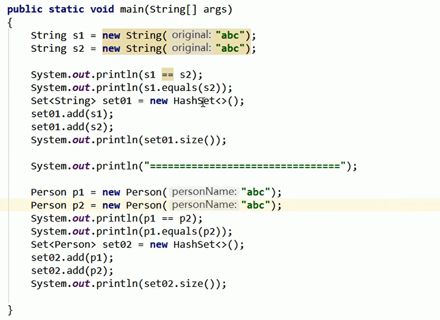

# 一、equals和==的区别

**（一）==**

==既可以比较基本数据类型，也可以比较引用数据类型

如果比较基本数据类型，那么比较的就是值

如果比较的引用数据类型，那么比较的就是地址

**（二）equals**

equals比较的是引用数据类型；

如果类没有重写equals方法，那么比较的就是对象的地址；

如果重写过，那么就按照重写之后的逻辑来；

# 二、例题

**答案：**

false

true

1

=======================

false

false

2

注：Set无序无重复

# 三、例题二

答案：

false  false   false    false    false